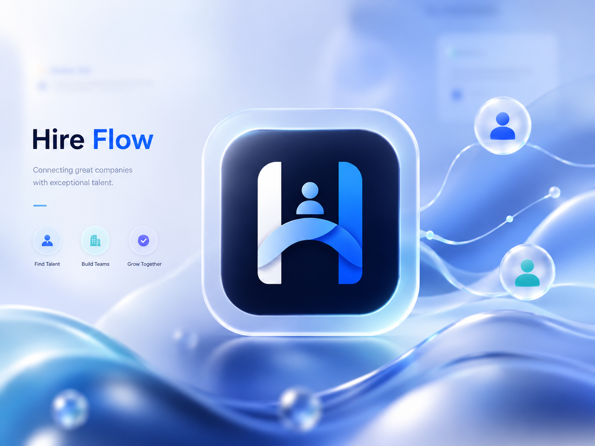

# 🚀 Hire Flow

<p align="center">
  
</p>

<p align="center">
  
  
  
  
  
  
  
  
  
  
  
  
</p>

### A full-stack, multi-tenant hiring platform built for scale

Hire Flow is a production-grade job board and applicant tracking system (ATS) supporting three distinct user roles — **Admins**, **Recruiters**, and **Job Seekers** — with real-time messaging, AI-powered resume assistance, and a public-facing job marketplace with SEO built in from the ground up.

Built with **Next.js 16**, **React 19**, **Prisma 7**, and **Better Auth**, this project demonstrates end-to-end product thinking: tenant isolation, rate limiting, optimistic concurrency, audit trails, and agent-assisted development workflows.

---

## 🧱 Tech Stack

| Category        | Technology                             | Version                          |
| --------------- | -------------------------------------- | -------------------------------- |
| Framework       | Next.js                                | `16.2.7`                         |
| UI Library      | React                                  | `19.2.4`                         |
| Language        | TypeScript                             | `^5`                             |
| ORM             | Prisma (+ `@prisma/adapter-pg`)        | `^7.8.0`                         |
| Database Driver | `pg`                                   | `^8.21.0`                        |
| Auth            | Better Auth (+ Prisma adapter)         | `^1.6.15`                        |
| Validation      | Zod                                    | `^4.4.3`                         |
| Data Fetching   | TanStack React Query                   | `^5.101.0`                       |
| Client State    | Zustand                                | `^5.0.14`                        |
| Forms           | React Hook Form (+ Hookform Resolvers) | `^7.78.0` / `^5.4.0`            |
| Realtime        | Pusher / pusher-js                     | `^5.3.4` / `^8.5.0`              |
| Email           | Resend + React Email                   | `^6.12.4` / `^6.6.1`             |
| Charts          | Recharts                               | `^3.8.1`                         |
| Animation       | Motion                                 | `^12.40.0`                       |
| PDF/DOC Parsing | `pdf-parse`, `mammoth`, `react-pdf`    | `^2.4.5` / `^1.12.0` / `^10.4.1` |
| Styling         | Tailwind CSS v4 + shadcn               | `^4` / `^4.11.0`                 |
| Date Handling   | date-fns                               | `^4.4.0`                         |
| Tooling         | ESLint 9, tsx, cross-env               | —                                |

---

## ✨ Features

### 🛡️ Admin

- User & recruiter management with ban/unban and role assignment
- Session inspection and bulk session revocation
- Admin team management with invite-based onboarding
- Job oversight dashboard with platform-wide analytics
- Real-time admin messaging (Pusher-backed private channels)
- Read-only applicant detail view with resume fallback chain

### 🏢 Recruiter

- Company profile CRUD + team invite management
- Full job posting lifecycle (draft → active → archived)
- **7-status applicant pipeline** with optimistic concurrency control
- **Bulk actions**: mass status transitions, bulk rejection with shared reasoning, one-time action constraints
- Applicant detail view: profile, timeline, resume, in-thread messaging, status controls
- **Analytics suite**: conversion funnels, trend charts, filterable by date range/status/type/location
- **CSV export**: RFC 4180-compliant, streamed via cursor-batched queries, 50K row cap
- Real-time, rate-limited direct messaging with applicants
- Role-aware notifications & activity feed with unread badges

### 👤 Job Seeker (User)

- Rich profile builder: experience, social links, skills, salary expectations
- **In-app resume builder** (structured JSON, not a generic text editor) + file upload (PDF/DOC/DOCX ≤10MB)
- **AI-powered resume enhancement** — multi-provider (Anthropic/OpenAI/Gemini), suggestion-only output with per-item apply/copy, ATS scoring, rate-limited to 5/day
- One-click apply with **resume snapshotting** (frozen at apply time, survives resume deletion)
- Application tracking: filterable list, status timeline, withdraw flow, in-thread recruiter messaging
- Bookmark/save jobs with graceful handling of jobs that later go inactive

### 🌍 Public

- Full-text job search with advanced filtering (work mode, employment type, experience, industry)
- **Dual-gate job visibility** — jobs only appear when both recruiter- and admin-level flags allow it
- Job detail pages with view tracking (deduplicated per session) and company preview cards
- Animated home page: hero search, category strip, featured jobs/companies, testimonials
- Career resources hub (resume tips, interview checklist, salary FAQ)
- **SEO-complete**: dynamic `sitemap.xml`, `robots.txt`, and JSON-LD `JobPosting` structured data

---

## 🤖 AI-Powered Features

Hire Flow ships a production-grade AI layer that goes beyond a single API call — it's an **architected multi-provider system** built for reliability, cost control, and user experience.

### Multi-Provider Abstraction

A single `AI_PROVIDER` env var (`anthropic` | `openai` | `google`) switches between **Claude**, **GPT**, and **Gemini** under the hood — no code changes, no provider lock-in. If no API key is configured, every AI surface degrades gracefully with a user-facing message rather than crashing the page.

### Resume Enhancement Engine

Job seekers get an interactive AI assistant that:
- **Analyses their resume** against the job market and suggests targeted improvements
- **Scores ATS compatibility** (keyword density, section completeness, formatting)
- **Returns per-suggestion controls** — apply or copy individual changes, never a blind rewrite
- **Snapshots the resume** at enhancement time so the original is preserved

### Rate-Limited Per-User Quota

Each user gets **5 AI enhancements per day**, enforced by an **atomic PostgreSQL `UPDATE … WHERE used < $3 RETURNING`** query — quota races are impossible even under concurrent requests. The quota survives server restarts (DB-backed, not in-memory).

### Graceful Degradation

Every AI feature checks for key presence at runtime. If no provider key is configured, the UI shows _"AI features temporarily unavailable"_ — the rest of the app works perfectly. This pattern is enforced consistently across resume enhancement, ATS scoring, and any future AI surface.

---

## 🏛️ Architecture & Design Decisions

**Resume Snapshotting** — At the moment a user applies, their resume (file URL or builder JSON) is frozen directly onto the `Application` row. This guarantees recruiters always see exactly what was submitted, even if the source resume is later edited or soft-deleted.

**Unified Status Timeline** — Both the recruiter and applicant surfaces write to a shared `ApplicationStatusChange` table starting from the very first `applied` transition. A single `StatusTimeline` component renders identically on both sides, eliminating duplicated timeline logic and drift.

**Multi-Provider AI Layer** — `lib/ai-client.ts` abstracts over Anthropic, OpenAI, and Google via a single `AI_PROVIDER` env var, with graceful degradation ("AI features temporarily unavailable") if no key is configured — so the app never hard-fails on a missing third-party dependency.

**Generic Rate Limiting** — A single in-memory sliding-window limiter (`lib/rate-limiter.ts`) backs both the apply endpoint (10/min) and job view tracking (100/min), with periodic cleanup to avoid memory growth. AI enhancement uses a persisted DB-backed limiter (`ResumeEnhancementLog`) since it must survive server restarts.

**Isolated Public Route Group** — The `(public)` route group ships its own navbar/footer shell, kept fully separate from `(auth)` and `(roles)` groups. This avoids double-chrome bugs and lets crawlers hit marketing/job pages without any auth machinery in the render path.

**Dual-Gate Job Visibility** — Every public-facing job query filters on **both** `status: "active"` (recruiter-controlled) **and** `isActive: true` (admin kill-switch). Missing either check would leak archived or platform-deactivated postings — this pattern is enforced consistently across listings, sitemap generation, and featured jobs.

**Middleware-Driven Redirects** — Rather than a single "role home" constant scattered across components, redirect logic lives centrally in `proxy.ts` middleware and shared auth hooks, keeping role-based routing consistent and easy to audit.

**Null-Guarded Structured Data** — JSON-LD `JobPosting` markup is injected via Next.js `generateMetadata`, with every field (salary, location, employment type) individually null-checked so no fabricated data ever reaches search engines.

---

## 📈 Project Scale

- **4 completed phases** (Admin → Recruiter → User → Public), fully sequenced and documented
- **3 distinct role-based dashboards** + 1 public marketplace
- **7-stage** applicant status pipeline with full audit trail
- **~150+ files** across API routes, feature modules, and shared components
- Real-time messaging across **3 role pairs** (admin↔user, recruiter↔applicant) via Pusher private channels

---

## 🏁 Getting Started

### Prerequisites

- **Node.js 20+**
- **PostgreSQL** database (local or hosted, e.g. Neon/Supabase)
- (Optional) Pusher app credentials for realtime features
- (Optional) An API key from Anthropic, OpenAI, or Google for AI resume suggestions

### 1. Clone & install

```bash
git clone https://github.com/<your-username>/hire-flow-next.git
cd hire-flow-next
npm install
```

### 2. Configure environment variables

Create a `.env` file in the project root:

```bash
# App
NODE_ENV=development
ALLOW_SEED=false                          # gate for running the seed script
DATABASE_URL=""                           # PostgreSQL connection string

# Auth (Better Auth)
BETTER_AUTH_SECRET=                       # random secret for session signing
BETTER_AUTH_URL=http://localhost:3000
NEXT_PUBLIC_APP_URL=http://localhost:3000
NEXT_PUBLIC_ENABLE_TEMP_MAIL_CHECK=false  # block disposable email domains on signup

# OAuth
GOOGLE_CLIENT_ID=""
GOOGLE_CLIENT_SECRET=""

# Transactional Email (Resend)
RESEND_API_KEY=""                         # use onboarding@resend.dev while testing
EMAIL_FROM="HireFlow <onboarding@resend.dev>"

# Bootstrap
PROMOTE_TO_SUPER_ADMINS="admin@hireflow.dev"   # comma-separated emails auto-eligible for promotion

# Realtime (Pusher)
PUSHER_APP_ID=000000
PUSHER_KEY=dummy-key
PUSHER_SECRET=dummy-secret
PUSHER_CLUSTER=us2
NEXT_PUBLIC_PUSHER_KEY=dummy-key
NEXT_PUBLIC_PUSHER_CLUSTER=us2

# AI Provider (optional — defaults to 'anthropic')
# Supported values: anthropic | openai | google
AI_PROVIDER=anthropic

# Anthropic (Claude)
ANTHROPIC_API_KEY=sk-ant-xxxxxxxxxxxx
ANTHROPIC_MODEL=claude-sonnet-4-20250514

# OpenAI (GPT) — uncomment and fill to use instead
# OPENAI_API_KEY=sk-xxxxxxxxxxxx
# OPENAI_MODEL=gpt-4o

# Google (Gemini) — uncomment and fill to use instead
# GEMINI_API_KEY=xxxxxxxxxxxx
# GEMINI_MODEL=gemini-2.0-flash
```

### 3. Set up the database

```bash
npx prisma migrate dev
npm run seed
```

### 4. Promote a super admin

The seed script (or your own signup) creates a regular user. To grant admin privileges to any email listed in `PROMOTE_TO_SUPER_ADMINS`:

```bash
npm run promote
```

Use `npm run demote` to revoke super admin status.

### 5. Run the dev server

```bash
npm run dev
```

Visit `http://localhost:3000`. Sign up as a job seeker directly, or promote your account to explore the Admin and Recruiter dashboards.

---

## 📂 Project Structure

```
hire-flow-next/
├── app/
│   ├── (public)/                # Marketing shell: home, jobs, resources, privacy, terms
│   ├── (auth)/                  # Login, register, verify-email, reset-password
│   ├── (roles)/
│   │   ├── admin/                # Admin dashboard, users, jobs, team, messages
│   │   ├── recruiter/            # Recruiter dashboard, jobs, applicants, analytics
│   │   └── user/                 # Job seeker dashboard, profile, resumes, applications
│   ├── api/                      # REST route handlers (admin/recruiter/user/jobs/files)
│   ├── features/                 # Feature-colocated components, hooks, queries, schemas
│   │   ├── admin/
│   │   ├── auth/
│   │   ├── recruiter/
│   │   ├── shared/
│   │   ├── user/
│   │   ├── jobs/
│   │   ├── landing/
│   │   ├── public/
│   │   └── notifications/
│   ├── sitemap.ts
│   ├── robots.ts
│   ├── layout.tsx
│   └── providers.tsx
├── components/
│   ├── chat/                    # Chat header, thread list, message input
│   ├── layout/                  # Page header, role layout client
│   ├── shared/                  # StatusTimeline, ConfirmActionButton, AvatarFallback…
│   └── ui/                      # Shared shadcn primitives (button, table, dialog, data-table…)
├── lib/                          # Core utilities
│   ├── api/                     # api-client, api-error, api-response, api-wrapper
│   ├── handlers/                # Message & invite handlers
│   ├── pusher/                  # Pusher server/client setup
│   ├── repositories/            # Application, job, message repositories
│   ├── services/                # Application, job, notification services
│   └── test/                    # Factories, fixtures, mocks, reset-db
├── stores/                       # Zustand: ui-store, chat-store
├── features/
│   └── messages/                 # Presence store & realtime messaging
├── utils/                        # env, format-string, etc.
├── scripts/                      # promote-super-admin, demote-super-admin
├── e2e/                          # Playwright spec files
├── prisma/
│   ├── schema.prisma
│   ├── seed.ts
│   └── scripts/
├── proxy.ts                      # Auth & role-redirect middleware
└── manifest.md                   # Living build log & architecture record
```

---

## 🧩 Key Patterns

- **Server Components by default** — client boundaries (`"use client"`) only where interactivity is required
- **REST route handlers for mutations, Server Actions for plain forms** — keeps complex validation/authorization logic out of form submission plumbing
- **Zod everywhere** — every write path runs `schema.safeParse()` before touching the database; errors flow through a centralized `lib/api-error.ts`
- **TanStack Query for server state, Zustand strictly for UI state** — sidebars/modals never touch API data, and vice versa
- **Pusher channel convention** — `private-thread-[id]` for conversations, `private-user-[id]` for personal notifications
- **Prisma singleton + `@prisma/adapter-pg`** — connection reuse across serverless invocations
- **Shared notification utility** — `lib/notifications.ts` performs the DB write and Pusher trigger atomically from a single call site
- **Rate limiting as infrastructure, not an afterthought** — generic sliding-window limiter reused across apply/view/AI endpoints

---

## ☁️ Deployment

Deployed on **Vercel**.

**Build command** (from `package.json`):

```bash
npx prisma migrate deploy && next build
```

**Required environment variables in production:**
`DATABASE_URL`, `BETTER_AUTH_SECRET`, `BETTER_AUTH_URL`, `NEXT_PUBLIC_APP_URL`, `GOOGLE_CLIENT_ID`, `GOOGLE_CLIENT_SECRET`, `RESEND_API_KEY`, `EMAIL_FROM`, `PROMOTE_TO_SUPER_ADMINS`, `PUSHER_APP_ID`, `PUSHER_KEY`, `PUSHER_SECRET`, `PUSHER_CLUSTER`, `NEXT_PUBLIC_PUSHER_KEY`, `NEXT_PUBLIC_PUSHER_CLUSTER`, `AI_PROVIDER`, and the corresponding AI provider key/model (e.g. `ANTHROPIC_API_KEY`, `ANTHROPIC_MODEL`)..

---

## 🧪 Testing

Hire Flow uses a layered testing strategy matched to each layer of the stack:

| Layer       | Tool                                     | What it covers                                                                                                                             |
| ----------- | ---------------------------------------- | ------------------------------------------------------------------------------------------------------------------------------------------ |
| Unit        | Vitest                                   | Pure logic: rate limiter, CSV builder, pagination, Zod schemas, AI client fallback                                                         |
| Integration | Vitest + local Postgres test DB          | API route handlers called directly, tenant isolation, transactions, audit trails                                                           |
| Performance | Vitest (`perf` project) + local Postgres | Scale budgets: analytics (PF1), applicant listing (PF2), CSV export (PF3), public job FTS search (PF4), resume AI-enhance quota race (PF5) |
| Component   | React Testing Library                    | Data table selection, bulk action logic, forms, AI suggestions panel                                                                       |
| End-to-End  | Playwright                               | Full role-based journeys (anonymous → user → recruiter → admin) with real Better Auth sessions                                             |

External services (Pusher, AI providers, Resend) are mocked at the module level — tests never make real network calls or incur API costs.

### Test infrastructure (Phases 0–6)

Tests are built incrementally per the [testing strategy](docs/testing/testing-strategy.md). Suites are colocated next to source as `*.test.ts` (unit), `*.test.ts` (integration, real Postgres), `*.perf.test.ts` (perf project), and `*.dom.test.tsx` (component).

| Phase | Focus                               | Covers                                                                                                                                                                                                                                                                                                                                                                                                                                                  |
| ----- | ----------------------------------- | ------------------------------------------------------------------------------------------------------------------------------------------------------------------------------------------------------------------------------------------------------------------------------------------------------------------------------------------------------------------------------------------------------------------------------------------------------- |
| 0     | Test infrastructure                 | `vitest.config.ts` (react + tsconfig-paths plugins), `lib/test/test-db.ts` (isolated Prisma client), `lib/test/reset-db.ts` (`RESTART IDENTITY CASCADE` truncation in dependency order), `lib/test/factories.ts` (`createTestUser`/`Company`/`Job`/`Application`/`Resume`/`Thread`), `lib/test/auth-fixtures.ts` (`mockSession`), `lib/test/mocks.ts` (`mockPusherTrigger`/`mockAiClient`/`mockResend`), `global-setup.ts` runs `prisma migrate deploy` |
| 1     | Input validation & schema hardening | SQL-injection rejection for raw analytics query params (Zod UUID/ISO dates); edge cases for `profile`/`resume`/`application-submit`/`job`/`auth`/`admin` schemas; mass-assignment (over-posting) prevention on role/patch/apply routes                                                                                                                                                                                                                  |
| 2     | Unit tests: pure logic              | `lib/rate-limiter.ts`, `csv-builder.ts` (RFC 4180 escaping), `lib/pagination.ts`, `api-error/api-response`, `lib/routes.ts`, `lib/job-categories.ts`, `rate-limit-message.ts`, `ai-client.ts`; Zod schema tests; `require-role.ts`, `validator.ts`, `presence-store.ts`, `applicant-table-utils.ts`                                                                                                                                                     |
| 3     | Auth & authorization                | Session/token security (expired/malformed/missing → 401, cross-role → 403); IDOR protection for every resource (application, job, resume, profile, thread, message, notification, bookmark, admin actions); middleware redirect matrix                                                                                                                                                                                                                  |
| 4     | Integration: API routes + real DB   | All 17 priority route groups (tenant isolation, public-job gate, apply, status/bulk/revert, resume CRUD, ai-enhance rate limit, messages, bookmarks, export, ban/sessions, withdraw, files/download, analytics, notifications, role PATCH, upload); file upload/download edges, notification delivery, search/FTS sanitization, pagination boundaries, audit-trail integrity, error-shape/info-leak, concurrent race conditions                         |
| 5     | Component tests (RTL)               | `data-table`, `applicants-table`, `bulk-reject-dialog`, `status-timeline`, `resume-builder-form`, `ai-suggestions-panel`, `job-search-bar`, `save-job-button`, `account-popover`, `apply-modal`, chat components, `no-company-prompt`                                                                                                                                                                                                                   |
| 6     | End-to-end (Playwright)             | 10 role-based journeys (anonymous apply redirect, user apply, recruiter pipeline, bulk reject, admin ban, messaging roundtrip, AI enhance, CSV export, cross-role access, IDOR deep links) across anonymous/user/recruiter/admin storage states                                                                                                                                                                                                         |

### Performance & stability tests (Phase 7)

The `perf` Vitest project runs tests matching `*.perf.test.ts` against a **real** Postgres `hireflow_test` database (no data-layer mocks) with a 300s timeout. Helpers live in `lib/test/perf.ts` (`measure`, `assertWithin`, `assertMemoryWithin`) and seed factories in `lib/test/factories/seed-factories.ts`.

| Test    | File                                                              | What it asserts                                                               |
| ------- | ----------------------------------------------------------------- | ----------------------------------------------------------------------------- |
| PF1     | `app/features/recruiter/queries/analytics-queries.perf.test.ts`   | Analytics aggregation over a large dataset within budget                      |
| PF2     | `app/features/recruiter/queries/application-queries.perf.test.ts` | Applicant listing/pagination at scale                                         |
| PF3     | `app/features/recruiter/queries/export-queries.perf.test.ts`      | CSV export throughput                                                         |
| PF4     | `app/features/jobs/queries/public-job-queries.perf.test.ts`       | Public job FTS search (`search:"engineer"`) ≤ 1000ms using GIN indexes        |
| PF5     | `app/api/user/resumes/[id]/ai-enhance/route.perf.test.ts`         | Atomic daily quota (limit 5) survives concurrent requests — exactly 5 succeed |
| RL1–RL5 | `lib/test/unit/rate-limit.test.ts`                                | Rate limiter: restart persistence, concurrent windows, `max:0` guard, etc.    |

Supporting infra: `Application` indexes (`@@index([appliedAt])`, `@@index([jobId, appliedAt])`) and GIN FTS indexes on `Job.title`/`Job.description`; a `ResumeEnhancementQuota` table backing PF5's atomic `UPDATE … WHERE used < $3 RETURNING`.

### Running tests

`vitest.config.ts` defines three projects: `default` (5s timeout — unit + integration), `dom` (5s timeout — component/RTL tests), and `perf` (300s timeout — `*.perf.test.ts` against a real Postgres test DB). By default `npm run test` runs all three; use `--project` to target a specific one.

```bash
# One-time: create local test database
createdb hireflow_test

# Add to .env.test
DATABASE_URL_TEST="postgresql://<user>:<password>@localhost:5432/hireflow_test"

# All projects (default + dom + perf)
npm run test
npm run test:watch
npm run test:coverage

# Component/DOM tests only
npx vitest run --project dom

# Performance/safety project only (real Postgres, long timeout)
npx vitest run --project perf

# Specific combination
npx vitest run --project default --project perf

# Apply migrations to the test database before the first run (global-setup also does this)
npx prisma migrate deploy --schema prisma/schema.prisma

# End-to-end (spins up a production build automatically)
npm run test:e2e
npm run test:e2e:ui   # interactive mode
```

Coverage thresholds are enforced via `vitest.config.ts` (currently `lines: 22, functions: 54, statements: 22, branches: 67`) and ratchet upward as suites mature.

---

## 📄 License

This project is available under the [MIT License](LICENSE).

## 📬 Contact

Built by **Mohamed Hazeem** — reach out via [a.mohamedhazeem@gmail.com](mailto:a.mohamedhazeem@gmail.com) or [GitHub](https://github.com/Mohamedhazeem).
